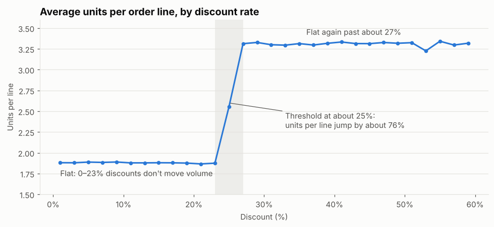
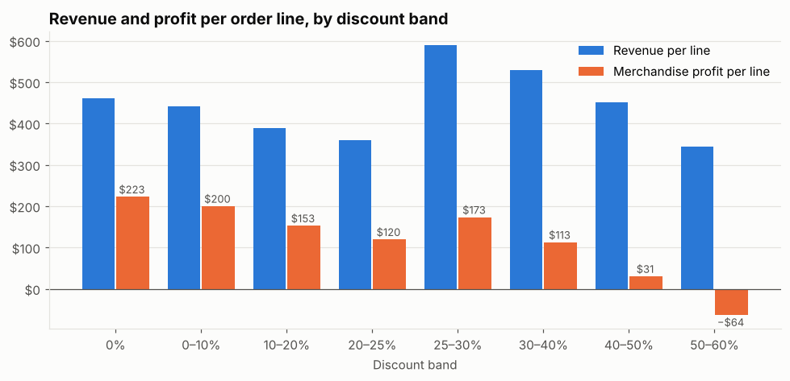

# E-Commerce Price Sensitivity Analysis

How do customers respond to discounts? Where does extra discount buy extra volume, and where does it just give away margin?

**Data:** [E-Commerce Sales & Customer Analytics](https://www.kaggle.com/datasets/datascikhan/e-commerce-sales-and-customer-analytics) on Kaggle: about 138k orders and 398k order lines across 1,175 products, 2021–2025.
**Notebooks:**
- [`Price_Sensitivity_Analysis.ipynb`](Price_Sensitivity_Analysis.ipynb): the discount and demand analysis.
- [`Case_Study_Profit_Growth.ipynb`](Case_Study_Profit_Growth.ipynb): a practice consulting case built on the same data. It works through clarifying questions, a profit tree, hypotheses, sizing, data sanity checks, prioritization and an answer-first recommendation, with a "Your turn" prompt and model answer at each step.
- [`Tableau_Dashboard_Plan.md`](Tableau_Dashboard_Plan.md): the build plan for an interactive Tableau dashboard of the case, for the Sales, Finance, Growth, Product and Marketing teams.

## Key findings

**1. Price sensitivity is a threshold, not a slope.** List prices never change in this dataset, so all price variation comes from discounts. Discounts of 0–23% have no effect on volume. At about 25% off, units per order line jump 76% (1.88 → 3.31), and going deeper adds nothing.



**2. Elasticity depends on where you are on the curve.** It's about 0 within each plateau and about −1.2 (elastic) across the threshold. A single elasticity estimate would hide this.

**3. Small discounts and very deep discounts both lose money.** Merchandise profit per line is highest at full price (\$223) and lowest just under the threshold (\$120 at 20–25% off). The 25–30% band earns the most revenue of any band. Past 30%, revenue and profit both fall, and at 50–60% off the average line loses \$64.



**4. A misleading pattern in the returns data.** Returned lines almost always show a 0% discount, most likely because refunds wipe the discount field. That makes deep discounts look like they prevent returns when they probably don't, so this pattern is flagged and not used.

**5. A simple policy change: +29% merchandise profit with the same volume.** Dropping discounts under 23% (+22%) and capping discounts at 30% (+7%) would together have added about \$18.6M in merchandise profit over five years, without losing any units.

## Case study: restarting profit growth

**Problem:** revenue has been flat at about \$34M a year for five years, and the CEO wants +20% merchandise profit (+\$2.6M a year) within three years.

**Diagnosis:** everything is flat except new customers, which fell 96% from 2022 to 2025. The business is living off an aging customer base.

**Recommendation** (risk-adjusted, about \$3.1M a year against the \$2.6M target):
- **Discount redesign:** stop discounts under 23% and cap discounts at 30%. Worth \$1.9M a year risk-adjusted; A/B test it first.
- **Restart acquisition:** about \$0.8M a year by year three.
- **Payment-failure recovery:** every cancelled order is a failed payment. About \$0.25M a year.
- **Return reduction:** about \$0.14M a year.

## Caveat

The demand response is identical across all 15 categories, all 4 customer segments and every year from 2021 to 2025. Real shoppers don't behave that uniformly, which strongly suggests the data is **synthetic**. The method carries over to real data (find where price variation comes from, measure the response piece by piece, test policies), but the specific numbers describe this dataset only.

## Methods

- Joined order lines to the product catalog and order header (status, segment, date).
- Checked where price variation comes from (each product has one fixed list price, so all variation is discount).
- Measured units per order line in 2-point discount bins, with elasticities estimated within and across the threshold.
- Compared the response across categories and customer segments.
- Calculated revenue (gross sales − discount) and merchandise profit (revenue − product cost) by discount band.
- Simulated alternative discount policies: each line keeps its observed volume unless the new discount moves it across the threshold.

## Reproducing

The data is pulled from the Kaggle API, not stored in the repo.

```bash
pip install -r requirements.txt
python download_data.py          # saves the CSVs to ./data (git-ignored)
jupyter notebook Price_Sensitivity_Analysis.ipynb
```

Credentials are picked up from `KAGGLE_API_TOKEN` (Bearer), from `KAGGLE_USERNAME` + `KAGGLE_KEY` or `~/.kaggle/kaggle.json` (Basic auth), or from a proxy that adds the `Authorization` header itself.
