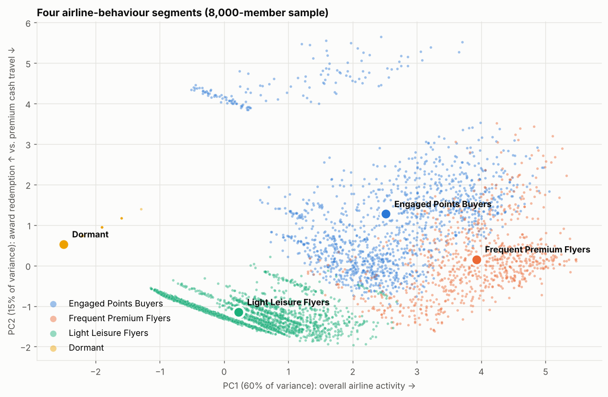
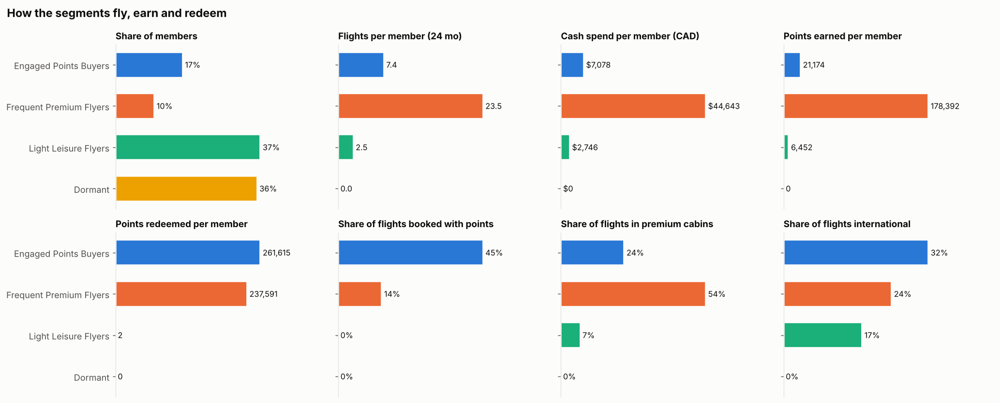
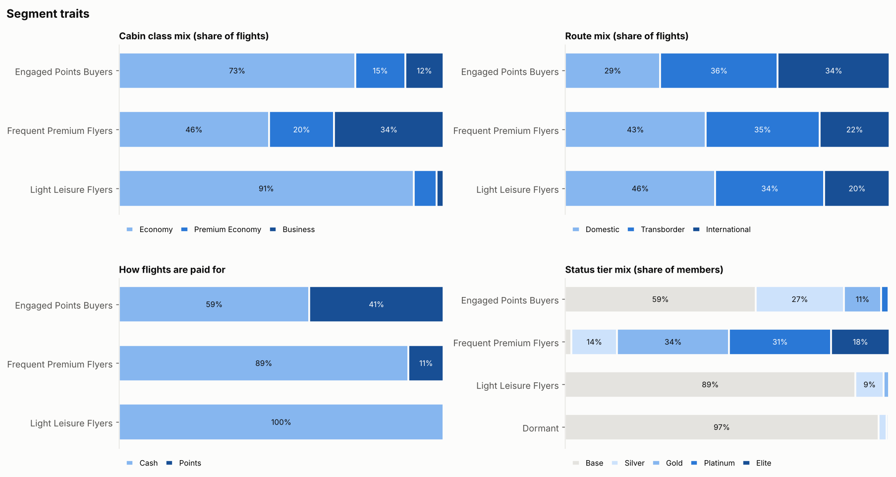
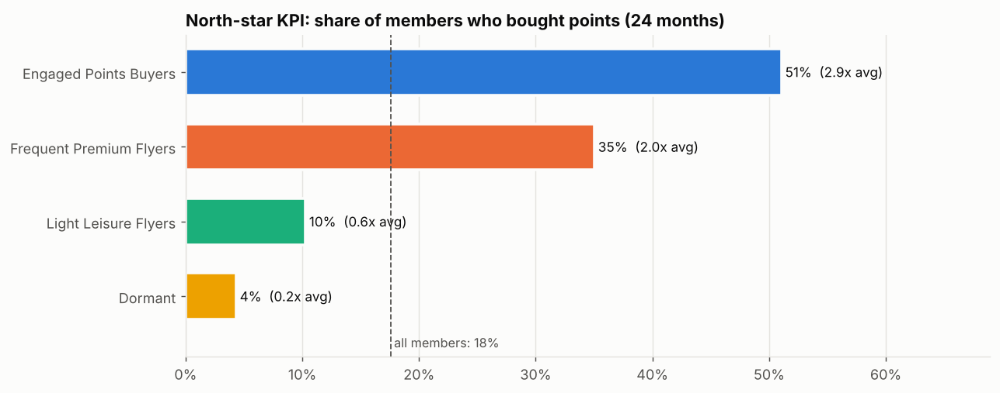
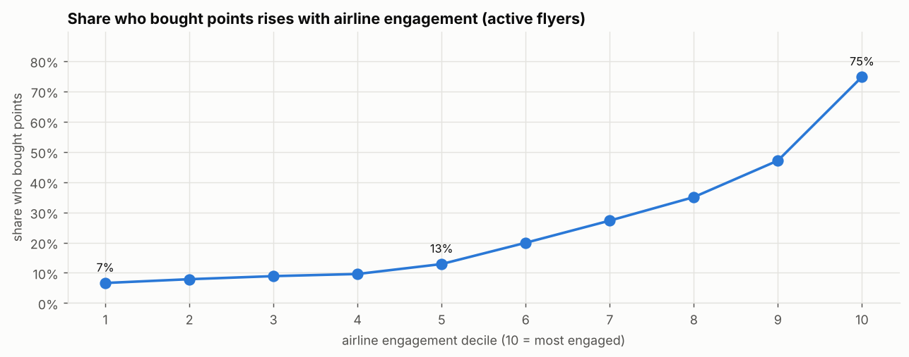
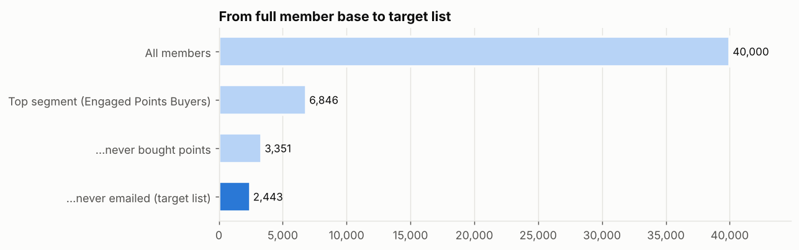

# Overview
This project segments the members of an airline loyalty program using the **airline's transactional data**: flights, spend, cabin, routes, and points earned and redeemed. It then tests whether airline engagement predicts **points buying**.

The segment with the highest share of points buyers becomes the focus. From it, the project pulls the lowest-hanging fruit: members who have **never bought points** and were **never on our email list**.

It recreates a project I completed as an analyst at a company that sells loyalty-program solutions (such as points sales) to major airline partners. The original used confidential partner data, so this version runs on a **synthetic dataset** with the same structure (see [`generate_data.py`](generate_data.py)).

**Notebook:** [Member_Segmentation.ipynb](Member_Segmentation.ipynb)

## Business question
> Are the members most engaged with the airline also the most likely to buy points? Within that group, who is the easiest next buyer to win?

**North-star KPI:** the share of members who have bought points.

## Data
Four tables covering 24 months of activity (Jan 2024 to Dec 2025) for 40,000 members:

| Table | Source | Grain | Key fields |
|---|---|---|---|
| `members.csv` | airline | 1 row per member | tier, enrolment date, home airport, email opt-in, points balance |
| `flights.csv.gz` | airline | 1 row per booking | booking / departure / return dates, route type, cabin class, cash fare (CAD), fare in points, points earned |
| `points_purchases.csv` | points-sales platform | 1 row per purchase | points bought, bonus points, amount (USD), promo flag |
| `marketing_contacts.csv.gz` | points-sales platform | 1 row per member per campaign | campaign, send date, opened, clicked |

The generator gives each member a hidden "persona" that drives their behaviour. The persona is **not** saved, so the clustering has to find the structure from behaviour alone. Rebuild the data with `python generate_data.py`.

## Method
1. **Data quality checks:** duplicates, orphaned keys, impossible dates, award-fare consistency.
2. **Feature engineering:** one row per member covering flights, cash spend, points earned and redeemed, award-flight share, premium-cabin and international share, booking recency, and tier.
3. **K-Means on airline features only:** `log1p` on skewed metrics plus standard scaling. *k* = 4 is chosen from the elbow plot and silhouette scores. **Points-purchase data is held out of the clustering**, so the KPI is an independent test rather than a circular one.
4. **Segment profiling and visualization:** PCA map, a feature "fingerprint" heatmap, activity, cabin, route, payment and tier mixes, distributions, and monthly activity.
5. **North-star KPI:** share of members who bought points, by segment and by airline-engagement decile.
6. **Look-alike score:** a logistic regression on airline features learns what buyers look like and ranks non-buyers.
7. **Target list:** top segment, never bought points, never on our email list, ranked by look-alike score.

## Results

### Segments (airline behaviour only)




| Segment | % of members | Profile |
|---|---|---|
| **Engaged Points Buyers** | 17% | Fly regularly and redeem points for about 45% of flights; above-average international travel |
| Frequent Premium Flyers | 10% | Highest flights, spend and tier; mostly premium cabins paid in cash |
| Light Leisure Flyers | 37% | A few economy trips, almost all cash |
| Dormant | 36% | No flights in 24 months |

### North-star KPI: share who bought points



- The segments were built without any purchase data, yet **Engaged Points Buyers have the highest share who bought points: 51%, against 18% across all members (2.9x)**. They are 17% of members but make up 50% of buyers and 74% of points revenue.
- Across active flyers, the share who bought rises steadily with airline engagement, from 7% in the bottom decile to 75% in the top.
- **Redemption is the link.** Frequent Premium Flyers are just as engaged overall but pay cash, and only 35% of them have bought points. Booking award flights is the strongest look-alike signal (hold-out ROC-AUC 0.83).

### Target list: lowest-hanging fruit


- About **half of the top segment (3,351 members) has never bought points.**
- Of those, **2,443 were never on our email list.** They look like our buyers on the airline side but have never been asked. They are saved in [`output/target_list.csv`](output/target_list.csv), ranked into High / Medium / Low priority by look-alike score.
- About 70% are opted in to email and can join the next campaign. The rest need another channel, such as on-site or in-app offers after an award search.
- Converting 10% of the list would lift the top segment's share who bought from **51% to 55%**.

## Recommendations
- Make **share of members who bought points** the north-star KPI and track it by segment.
- Add the opted-in target members to the next points campaign, starting with the High priority tier. Lead with redemption messaging, such as "top up to book your next award trip".
- Keep a randomized holdout in each tier to measure incremental conversion.
- Treat Frequent Premium Flyers with status or upgrade offers rather than points sales. Light Leisure and Dormant members need engagement before a points offer.

## Repo contents
```
generate_data.py            synthetic data generator (seeded, reproducible)
Member_Segmentation.ipynb   full analysis
data/                       generated input tables
figures/                    charts exported by the notebook
output/target_list.csv      final target list (never bought, never emailed)
output/member_segments.csv  segment, engagement score and look-alike score for every member
```

## Run it
```bash
pip install -r requirements.txt
python generate_data.py          # optional: the notebook regenerates data if missing
jupyter notebook Member_Segmentation.ipynb
```
